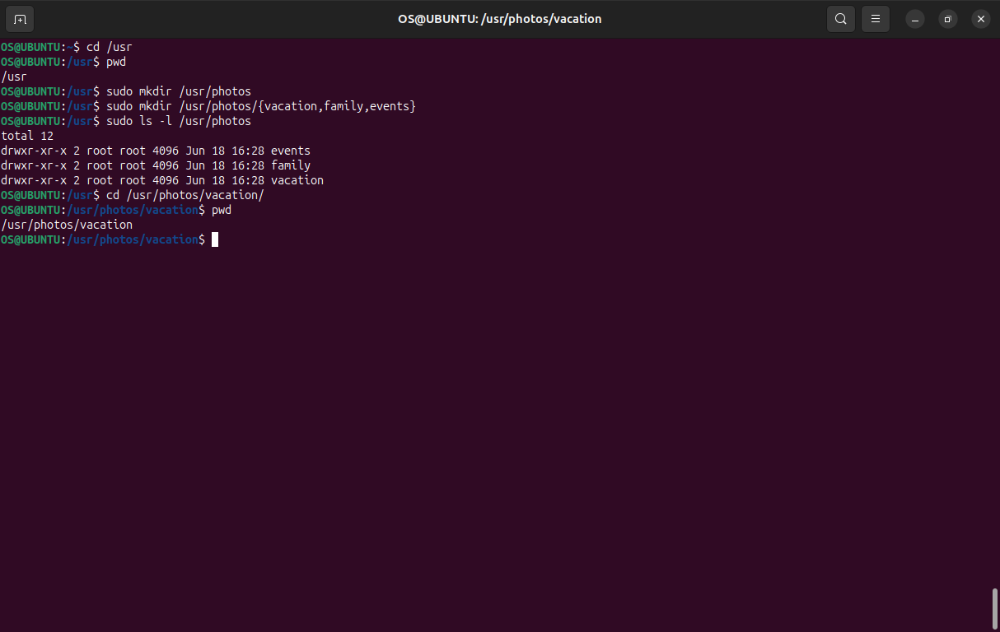

#### Linux Commands Implementation
## A. Basic Navigation
Current Directory

bash
pwd

# List Root Directory

bash
sudo ls -l /

Navigate to /usr

bash
cd /usr
pwd
## B.  Directory Creation (Side Hustle Task 1)
Create photos directory

bash
sudo mkdir /usr/photos

# Create 3 subdirectories

bash
sudo mkdir /usr/photos/{vacation,family,events}
Verify creation

bash
sudo ls -l /usr/photos

# Navigate and show path!

bash
cd /usr/photos/vacation
pwd

## C. File Operations
Create test file

bash
sudo touch /usr/photos/example.txt
View file content

bash
sudo cat /etc/os-release

# Copy file

bash
sudo cp /usr/photos/example.txt /usr/photos/example_copy.txt
Move/Rename file

bash
sudo mv /usr/photos/example_copy.txt /usr/photos/renamed.txt
Delete file

bash
sudo rm /usr/photos/renamed.txt

## D. Advanced Commands
Recursive listing

bash
sudo ls -R /usr/photos
Find command

bash
sudo find /home -name "*.txt"

